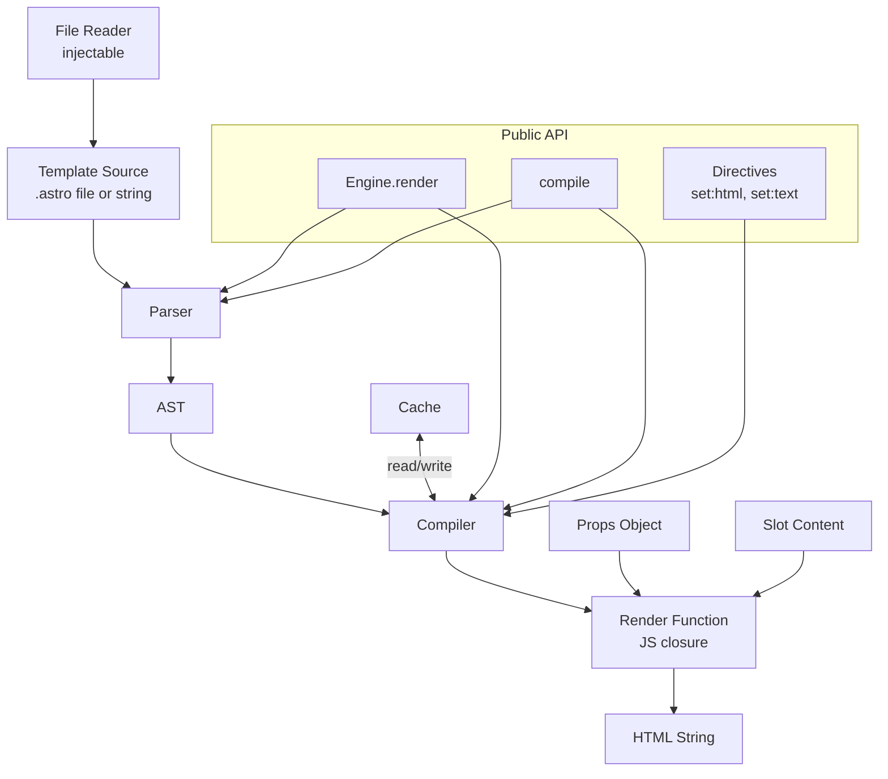

# AGENT.md

This document provides technical context and guidance for AI agents working on the `astro-template-engine` project.

## Context

The `astro-template-engine` is a runtime-agnostic, Astro-like template engine for rendering HTML. It transforms `.astro` template syntax into efficient JavaScript render functions that produce HTML strings.

### Tech Stack

- **TypeScript**: Source code.
- **Vitest**: Unit and integration tests.
- **fast-check**: Property-based testing for correctness guarantees.

## Architecture



The engine follows a standard pipeline:
**Source Text → Parser → AST → Compiler → Render Function → HTML String**.

- **Parser (`src/parser.ts`)**: Tokenizes and parses raw template text into an Abstract Syntax Tree (AST).
- **AST (`src/types.ts`)**: Intermediate representation of the template, including frontmatter, JSX-like elements, expressions, and component imports.
- **Compiler (`src/compiler.ts`)**: Transforms the AST into a JavaScript closure (`RenderFunction`). It handles component resolution, prop forwarding, slot substitution, and special attributes like `class:list` and `style` objects.
- **Engine (`src/index.ts`)**: Provides the main entry point and orchestrates template loading, resolution, and caching.
- **Cache (`src/cache.ts`)**: Stores compiled `RenderFunction` instances.
- **HTML Escaper (`src/escape.ts`)**: Provides security by default through automatic HTML entity escaping.

## Data Models (AST)

The template is parsed into a structured AST:

```typescript
export interface TemplateAST {
  frontmatter: FrontmatterNode;
  body: TemplateNode[];
  imports: ComponentImport[];
}

export interface FrontmatterNode {
  source: string; // raw TS/JS source between --- fences
}

export interface ComponentImport {
  localName: string; // e.g. "Button"
  specifier: string; // e.g. "./Button.astro"
}

export type TemplateNode =
  | ElementNode
  | ExpressionNode
  | TextNode
  | SlotNode
  | ScriptNode
  | StyleNode
  | RawNode;

export interface SpreadAttrNode {
  type: 'spread';
  expression: string; // raw JS expression source
}

export interface ElementNode {
  type: 'element';
  tag: string; // "" or "Fragment" for fragments
  attrs: (AttrNode | SpreadAttrNode)[];
  children: TemplateNode[];
  selfClosing: boolean;
}

export interface AttrNode {
  name: string;
  value: string | ExpressionNode | true; // true = boolean attribute
}

export interface ExpressionNode {
  type: 'expression';
  source: string; // raw JS/TS expression source
}

export interface TextNode {
  type: 'text';
  value: string;
}

export interface SlotNode {
  type: 'slot';
  name: string; // "" = default slot
  children: TemplateNode[]; // fallback content
}

export interface ScriptNode {
  type: 'script';
  content: string;
  attrs: (AttrNode | SpreadAttrNode)[];
}

export interface StyleNode {
  type: 'style';
  content: string;
  attrs: (AttrNode | SpreadAttrNode)[];
}

export interface RawNode {
  type: 'raw';
  html: string;
}
```

## Correctness Properties

These properties serve as the bridge between human-readable specifications and machine-verifiable correctness guarantees (verified with `fast-check`).

1. **Parser Round-trip**: `parse(print(parse(src).ast))` produces an equivalent AST.
2. **HTML escaping applied**: Interpolated strings and primitives are always escaped.
3. **Raw content verbatim**: Content passed through `html\`...\`` is inserted verbatim.
4. **RawHtml Idempotence**: Wrapping already-safe content doesn't double-escape it.
5. **Null/Undefined Expressions**: Render as an empty string `""`.
6. **Cache Reference Continuity**: Repeating `compile` with cache enabled returns the same `RenderFunction` reference.
7. **Dev Mode Isolation**: `devMode: true` bypasses cache and returns fresh references.
8. **Cache Invalidation Precision**: `invalidate(key)` removes only the target entry.
9. **Expression Reflection**: Props, conditionals, and loops are correctly reflected in output.
10. **Slot Substitution**: Named and default slots are correctly substituted.
11. **Attribute Forwarding**: JSX attributes are correctly passed to children as props.
12. **Fragment Support**: Empty tags `<>` and `<Fragment>` are correctly handled.
13. **Directives Support**: `set:html` and `set:text` directives work as expected.
14. **Spread Attributes**: Attributes can be spread using `{...props}` syntax.

## Error Handling

The engine defines specific error types for different failure points:

| Scenario                            | Error type     | Behavior                                               |
| ----------------------------------- | -------------- | ------------------------------------------------------ |
| Unclosed `---` frontmatter fence    | `ParseError`   | Return `{ ok: false, error }` with line/column         |
| Unclosed JSX tag                    | `ParseError`   | Return `{ ok: false, error }` with line/column         |
| Unresolvable component import       | `CompileError` | Return `{ ok: false, error }` with import specifier    |
| Circular component dependency       | `CompileError` | Return `{ ok: false, error }` listing the cycle        |
| File not found / unreadable         | `LoadError`    | Reject the Promise with path and OS error message      |
| Runtime expression evaluation error | `RenderError`  | Reject the Promise with expression source and JS error |

## Key Files & Responsibilities

- `src/index.ts`: Public API entry point (`Engine` class).
- `src/parser.ts`: Recursive-descent parser for Astro syntax.
- `src/compiler.ts`: Code generation from AST.
- `src/cache.ts`: LRU cache implementation.
- `src/escape.ts`: HTML escaping and trusted content markers (`RawHtml`).
- `types.ts`: Core interfaces, AST nodes, and error types.

## Coding Standards & Patterns

1.  **Runtime-Agnostic Core**: Do NOT import Node.js built-ins (`fs`, `path`, `crypto`) in the core rendering pipeline. Use injectable interfaces (like `readFile` and `resolvePath` in `EngineOptions`) for environment-specific I/O.
2.  **Security by Default**: All interpolated expressions MUST be passed through `escapeHtml` unless `autoEscape: false`.
3.  **Error Handling**: Use the custom error types (`LoadError`, `ParseError`, `CompileError`, `RenderError`) defined in `src/types.ts`.
4.  **Astro Global**: The global `Astro` object (alias for `props` and `slots`) is available in all templates. Use `Astro.props` and `Astro.slots` to access them.
5.  **Verification Flow**: Always run the mandatory validation pipeline (`format`, `lint`, `knip`, `typecheck`, `test`, `test:coverage`) after any code change. If all pass, update documentation (`README.md`, `AGENTS.md`) to reflect current project state.

## Common Agent Tasks

### Adding a New Template Feature

1.  Update `TemplateNode` in `src/types.ts` to include the new node type.
2.  Update the parser in `src/parser.ts` to recognize and produce the new node.
3.  Update the compiler in `src/compiler.ts` to generate code for the new node.
4.  Update the printer in `src/printer.ts` to serialize the new node.
5.  Add unit and property tests to verify the feature and its round-trip property.

### Fixing a Parser Bug

1.  Reproduce the bug with a minimal test case in `src/parser.test.ts`.
2.  Debug the recursive-descent logic in `src/parser.ts`.
3.  Ensure the fix maintains the round-trip property (Property 1) in `src/parser.property.test.ts`.

### Updating the Compiler

1.  Add test cases for the desired output in `src/compiler.test.ts`.
2.  Modify the code generation logic in `src/compiler.ts`.
3.  If the change affects performance, ensure the cache still functions correctly (Properties 6, 7).

## Testing

The tests should primary focus on testing **functionality** and the **public API**.

Run the full validation pipeline (mandatory after any code change):

```bash
pnpm format && pnpm lint && pnpm knip && pnpm typecheck && pnpm test && pnpm test:coverage
```

> [!IMPORTANT]
> If all validation steps pass, you MUST update the `README.md` and `AGENTS.md` files (e.g., to reflect changes in coverage, architecture, or documented properties).

Run the full test suite:

```bash
npm test
```

Run property-based tests only:

```bash
npm test -- -t property
```

All property tests are tagged with `// Feature: astro-template-engine, Property N: <description>`.
